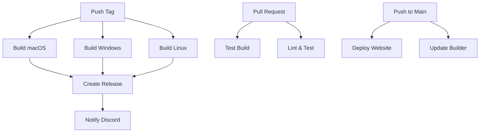

# GitHub Actions Workflows

This directory contains GitHub Actions workflows for automating the CorteXIDE build, test, and release process.

## Workflows Overview

### 1. Build and Release (`build-and-release.yml`)

**Triggers:**
- Push to version tags (e.g., `v0.1.0`, `v0.2.0`)
- Manual workflow dispatch

**What it does:**
- Builds CorteXIDE for all platforms (macOS, Windows, Linux)
- Creates distributable packages (DMG, EXE, DEB, RPM, AppImage)
- Automatically creates GitHub releases with all assets
- Generates comprehensive release notes
- Sends Discord notifications (if configured)

**Platforms:**
- **macOS**: ARM64 and x64
- **Windows**: ARM64 and x64  
- **Linux**: ARM64 and x64

### 2. Test Build (`test-build.yml`)

**Triggers:**
- Pull requests to `main` or `develop`
- Pushes to `main` or `develop`

**What it does:**
- Tests compilation on all platforms
- Runs linting and tests
- Verifies build output
- Ensures code quality before merging

### 3. Deploy Website (`deploy-website.yml`)

**Triggers:**
- Push to `main` branch (when website files change)
- Manual workflow dispatch

**What it does:**
- Builds the Next.js website
- Deploys to GitHub Pages
- Optionally deploys to Vercel (if configured)

### 4. Update Builder (`update-builder.yml`)

**Triggers:**
- Push to `main` branch (when builder files change)
- Manual workflow dispatch

**What it does:**
- Syncs builder files to the `cortexide-builder` repository
- Keeps the builder repository up-to-date

## How to Use

### Creating a New Release

1. **Update version numbers** in relevant files
2. **Create and push a tag:**
   ```bash
   git tag v0.2.0
   git push origin v0.2.0
   ```
3. **The workflow will automatically:**
   - Build for all platforms
   - Create a GitHub release
   - Upload all distributable files
   - Generate release notes

### Manual Release

1. Go to **Actions** tab in GitHub
2. Select **Build and Release** workflow
3. Click **Run workflow**
4. Enter the version (e.g., `v0.2.0`)
5. Click **Run workflow**

### Testing Changes

1. **Create a pull request** to `main` or `develop`
2. **The test workflow will automatically:**
   - Test compilation on all platforms
   - Run linting and tests
   - Verify build output

## Required Secrets

To use all features, configure these secrets in your repository:

### GitHub Token
- **Name**: `GITHUB_TOKEN`
- **Description**: Automatically provided by GitHub
- **Used for**: Creating releases, pushing to repositories

### Discord Webhook (Optional)
- **Name**: `DISCORD_WEBHOOK`
- **Description**: Discord webhook URL for release notifications
- **Used for**: Sending release notifications to Discord

### Vercel Token (Optional)
- **Name**: `VERCEL_TOKEN`
- **Description**: Vercel deployment token
- **Used for**: Deploying website to Vercel

## Workflow Dependencies



## Build Matrix

| Platform | Architecture | Output Format |
|----------|-------------|---------------|
| macOS    | ARM64       | DMG           |
| macOS    | x64         | DMG           |
| Windows  | ARM64       | EXE           |
| Windows  | x64         | EXE           |
| Linux    | ARM64       | DEB, RPM      |
| Linux    | x64         | DEB, RPM, AppImage |

## Troubleshooting

### Build Failures

1. **Check the Actions tab** for detailed error logs
2. **Common issues:**
   - Node.js version mismatch
   - Missing dependencies
   - Platform-specific build issues

### Release Issues

1. **Verify tag format** (must be `v*.*.*`)
2. **Check repository permissions**
3. **Ensure all build jobs completed successfully**

### Website Deployment

1. **Check GitHub Pages settings**
2. **Verify domain configuration**
3. **Check build logs for errors**

## Customization

### Adding New Platforms

1. **Add new job** in `build-and-release.yml`
2. **Update build matrix**
3. **Add artifacts to release**

### Modifying Release Notes

1. **Edit the release notes template** in `build-and-release.yml`
2. **Update the `Generate release notes` step**

### Adding Notifications

1. **Add new notification step** in `create-release` job
2. **Configure required secrets**

## Performance Optimization

- **Parallel builds** for different platforms
- **Caching** for Node.js dependencies
- **Artifact uploads** for large files
- **Conditional steps** to avoid unnecessary work

## Security

- **Minimal permissions** for GitHub token
- **Secrets management** for sensitive data
- **Dependency scanning** (can be added)
- **Code signing** (can be added for production)

## Monitoring

- **Workflow status badges** in README
- **Release notifications** via Discord
- **Build metrics** and timing
- **Error reporting** and alerts
