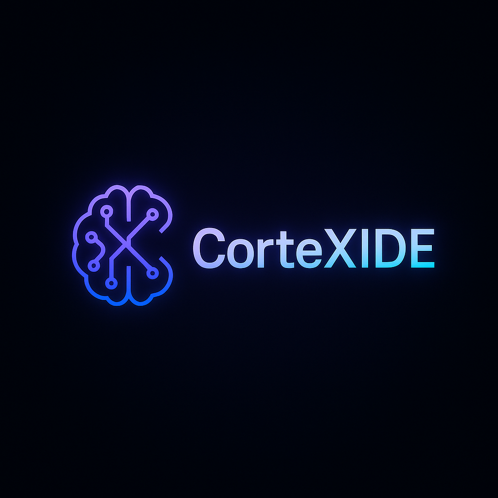

# CorteXIDE

<div align="center">
	
	
	<h3>Open-source AI IDE for privacy-first development</h3>
	
	[](https://opensource.org/licenses/MIT)
	[](https://discord.gg/cortexide)
	[](https://cortexide.com)
</div>

## 🚀 What is CorteXIDE?

**CorteXIDE** is an open-source, privacy-first AI IDE that gives you complete control over your data while providing powerful AI coding features. Built as a fork of Void IDE and VS Code, it offers a complete **Chat → Plan → Diff → Apply** workflow that runs locally and securely.

### ✨ Key Features

- 🤖 **AI-Powered Development**: Complete AI workflow from conversation to code changes
- 🔒 **Privacy-First**: Local-only by default, no telemetry, no data retention
- 🏠 **Self-Hosted**: Run any AI model locally with Ollama, vLLM, or OpenAI-compatible endpoints
- 🎯 **Repository Context**: AI understands your entire codebase for better suggestions
- ✅ **Safe Apply**: Built-in diff viewer and audit trail for all changes
- 🛡️ **Agent Modes**: Agent Mode and Gather Mode for different interaction levels
- 🔄 **VS Code Compatible**: Seamless migration with all your themes, keybinds, and settings

### 🎨 Why CorteXIDE?

Unlike proprietary AI IDEs like Cursor, CorteXIDE:
- **Never sends your code to third-party servers**
- **Gives you complete control over AI models and data**
- **Is fully open-source and auditable**
- **Supports any AI model or local hosting solution**
- **Maintains full VS Code compatibility**

**Local-only by default; no telemetry; no outbound requests. See `.cortexide/audit/log.jsonl`.**

## 🚀 Quick Start

### Download & Install

1. **Download** the latest release from [GitHub Releases](https://github.com/OpenCortexIDE/cortexide/releases)
2. **Install** CorteXIDE on your platform (Windows, macOS, Linux)
3. **Launch** and start coding with AI assistance!

### Development Setup

```bash
# Clone the repository
git clone https://github.com/OpenCortexIDE/cortexide.git
cd cortexide

# Install dependencies
npm ci

# Run in development mode
./scripts/code.sh --user-data-dir ./.tmp/user-data --extensions-dir ./.tmp/extensions
```

## 🛠️ Supported Platforms

- **Windows** (x64, ARM64)
- **macOS** (Intel, Apple Silicon)
- **Linux** (x64, ARM64)

## 🔧 AI Model Support

CorteXIDE supports a wide range of AI models:

### Local Models
- **Ollama** - Run models locally
- **vLLM** - High-performance local inference
- **OpenAI-Compatible** - Any compatible endpoint

### Cloud Models
- **OpenAI** (GPT-4, GPT-3.5)
- **Anthropic** (Claude 3.5, Claude 3)
- **Google** (Gemini 2.5, Gemini Pro)
- **xAI** (Grok 3)
- **And many more...**

## 🤝 Contributing

We welcome contributions! Here's how to get started:

1. **Read** our [Contributing Guide](CONTRIBUTING.md) for development setup and guidelines
2. **Check** our [Project Board](https://github.com/orgs/cortexide/projects/2) for current tasks
3. **Join** our [Discord Community](https://discord.gg/cortexide) for discussions
4. **Fork** the repository and submit a pull request

### Development Guidelines

- Follow the existing code style and patterns
- Add tests for new features
- Update documentation as needed
- Ensure all changes maintain privacy-first principles

## 📚 Documentation

- **Website**: [cortexide.com](https://cortexide.com)
- **Documentation**: [docs.cortexide.com](https://cortexide.com/docs) (coming soon)
- **API Reference**: Available in the IDE's built-in help system

## 🔍 Codebase Reference

CorteXIDE is a fork of the [vscode](https://github.com/microsoft/vscode) repository and [Void IDE](https://github.com/voideditor/void). For a guide to the codebase, see [VOID_CODEBASE_GUIDE](VOID_CODEBASE_GUIDE.md).

## 📄 License

CorteXIDE is released under the **MIT License**. See [LICENSE.txt](LICENSE.txt) for details.

## 🙏 Acknowledgments

CorteXIDE is built on the shoulders of giants:

- **[VS Code](https://github.com/microsoft/vscode)** - The foundation of our IDE
- **[Void IDE](https://github.com/voideditor/void)** - Our direct fork source
- **Open Source Community** - For making this project possible

## 📞 Support & Community

- 🌐 **Website**: [cortexide.com](https://cortexide.com)
- 💬 **Discord**: [Join our community](https://discord.gg/cortexide)
- 📧 **Email**: hello@cortexide.com
- 🐛 **Issues**: [GitHub Issues](https://github.com/OpenCortexIDE/cortexide/issues)
- 💡 **Feature Requests**: [GitHub Discussions](https://github.com/OpenCortexIDE/cortexide/discussions)

---

<div align="center">
	<strong>Built with ❤️ by the CorteXIDE community</strong>
	<br>
	<em>Empowering developers with privacy-first AI tools</em>
</div>
